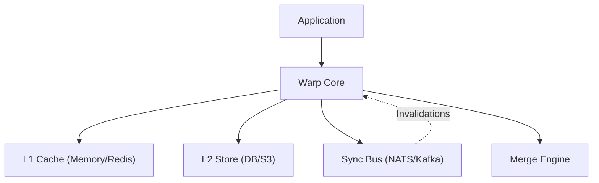

# Warp Core

The `core` package is the heart of Warp. It orchestrates the interaction between the **Cache**, **Storage Adapter**, **Sync Bus**, and **Merge Engine**.

## Architecture



## API Reference

### `New`

Creates a new Warp instance.

```go
func New[T any](
    c cache.Cache[merge.Value[T]], 
    s adapter.Store[T], 
    bus syncbus.Bus, 
    m *merge.Engine[T], 
    opts ...Option[T],
) *Warp[T]
```

- **c**: The L1 cache implementation.
- **s**: The L2 storage adapter.
- **bus**: The sync bus for distributed events (can be `nil` for local-only).
- **m**: The merge engine (can be `nil`, defaults to Last-Write-Wins).

### `Register`

Registers a key pattern with a consistency mode and TTL. **Required** before using any key.

```go
func (w *Warp[T]) Register(key string, mode Mode, ttl time.Duration, opts ...cache.TTLOption) bool
```

- **key**: The exact key string (patterns not yet supported in v1).
- **mode**: `ModeStrongLocal`, `ModeEventualDistributed`, or `ModeStrongDistributed`.
- **ttl**: Duration after which the item expires from L1 cache.

### `RegisterDynamicTTL`

Registers a key with a dynamic TTL strategy (e.g., Adaptive TTL).

```go
func (w *Warp[T]) RegisterDynamicTTL(key string, mode Mode, strat cache.TTLStrategy, opts ...cache.TTLOption) bool
```

### `SetQuorum`

Configures the required quorum for `ModeStrongDistributed`.

```go
func (w *Warp[T]) SetQuorum(key string, replicas int) bool
```

### `Get`

Retrieves a value.

```go
func (w *Warp[T]) Get(ctx context.Context, key string) (T, error)
```

- Returns `ErrNotFound` if key is missing in both Cache and Store.
- Returns `ErrUnregistered` if key was not registered.

### `Set`

Updates a value.

```go
func (w *Warp[T]) Set(ctx context.Context, key string, value T) error
```

- Applies Merge logic if registered.
- Updates Cache and Store.
- Propagates invalidation (or waits for quorum) based on Mode.

### `Invalidate`

Removes a value from Cache (and effectively "deletes" it if your Store supports deletion semantics, though `Invalidate` is primarily a cache operation).

```go
func (w *Warp[T]) Invalidate(ctx context.Context, key string) error
```

### `Warmup`

Loads all registered keys from the Store into the Cache.

```go
func (w *Warp[T]) Warmup(ctx context.Context)
```

### `Txn` (Transactions)

Starts a new transaction.

```go
txn := w.Txn(ctx)
txn.Set("k1", "v1")
txn.Delete("k2")
txn.CompareAndSwap("k3", "old", "new")
err := txn.Commit()
```

- **Commit**: Applies all operations atomically. If using `ModeStrongDistributed`, it waits for quorum for *all* keys before applying *any*.

### `Unregister`

```go
func (w *Warp[T]) Unregister(key string)
```
Removes a key registration.

### `GetAt` (Versioned Cache)

```go
func (w *Warp[T]) GetAt(ctx context.Context, key string, at time.Time) (T, error)
```
Retrieves the value for a key at a specific point in time. Requires `merge.Value` to be used as the cache type.

### `PublishErrors`

```go
func (w *Warp[T]) PublishErrors() <-chan error
```
Returns a channel to listen for asynchronous errors occurring during background invalidation publishing.

### `WithMetrics`

```go
func WithMetrics[T any](reg prometheus.Registerer) Option[T]
```
Enables Prometheus metrics collection for core operations.

### `GrantLease` / `RevokeLease`

See [Leases](leases.md).

## Consistency Modes

| Mode | Behavior | Use Case |
| :--- | :--- | :--- |
| **`ModeStrongLocal`** | Data is consistent *on this node*. No network calls on write. | Local counters, temporary processing data. |
| **`ModeEventualDistributed`** | Writes are local, but invalidations are sent to other nodes asynchronously. | **Default**. User profiles, sessions. |
| **`ModeStrongDistributed`** | Writes wait for a quorum of nodes to acknowledge. | Critical configuration, distributed locks. |

## Request Coalescing (Singleflight)

To prevent cache stampedes (Thundering Herd), `Core` automatically implements request coalescing using `singleflight`. If multiple concurrent requests arrive for the same missing key, Warp will perform the fetch (from L2 or Source) only once and share the result with all callers.

## Structured Logging

Warp uses `log/slog` for structured logging. By default, it logs at `Info` level. You can configure the logger or integrate it with your application's handler (e.g., JSON handler for production).

## Metrics

Warp exposes Prometheus metrics. See [Metrics](metrics.md).
