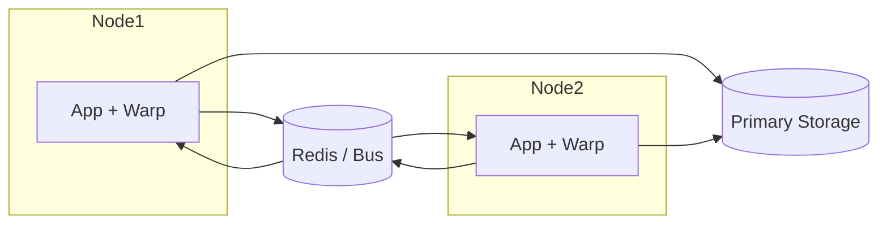

# Warp Overview

Warp is a data orchestration and synchronization layer designed for distributed backends. It sits between the application logic and the primary storage, offering fast access to hot data with configurable consistency modes and distributed invalidation.

Warp is composed of modular packages:

- [Core](core.md) – orchestrates cache, storage, sync bus and merge engine.
- [Cache](cache.md) – pluggable cache implementations with TTL and metrics.
- [Adapter](adapter.md) – abstraction over primary storage used for warmup and fallback.
- [Sync Bus](syncbus.md) – propagation of invalidations across nodes.
- [Merge Engine](merge.md) – conflict resolution strategies including custom merge functions.
- [Validator](validator.md) – optional background consistency checks between cache and storage.

## Deployment

The typical setup runs one Warp instance alongside each application node. Every instance keeps a local cache and communicates
through a shared bus to distribute invalidations across the cluster.

- **Buses** – Redis Pub/Sub or Streams, NATS, Kafka, or any transport implementing the `syncbus` interface can be used for
  distributed invalidation.
- **Cache warmup** – call `Warmup` on startup to prefill hot keys via the storage adapter or schedule background warmup cycles.
- **Validator modes** – run the validator in `ModeNoop` for metrics, `ModeAlert` for external monitoring, or `ModeAutoHeal` to
  refresh stale cache entries automatically.

Refer to the README for a high level description and to the specific documents for detailed usage examples.
