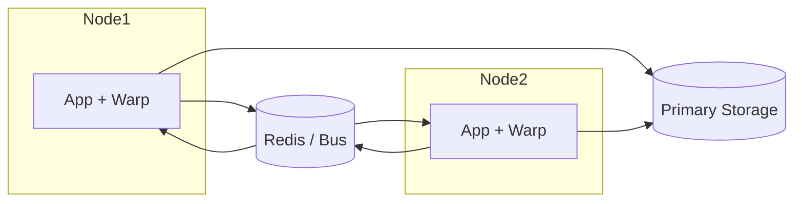

# Warp Overview

Warp is a data orchestration and synchronization layer designed for distributed backends. It sits between the application logic and the primary storage, offering fast access to hot data with configurable consistency modes, distributed invalidation, locking and leases, a watch bus for streaming updates, versioned caching, and built-in metrics. Start with the [Getting Started](getting-started.md) tutorial and consult the [Glossary](glossary.md) for terminology.

Warp is composed of modular packages:

- [Core](core.md) – orchestrates cache, storage, buses and merge engine.
- [Cache](cache.md) – pluggable cache implementations with TTL.
- [Adapter](adapter.md) – abstraction over primary storage used for warmup and fallback.
- [Sync Bus](syncbus.md) – propagation of invalidations across nodes.
- [Watch Bus](watchbus.md) – lightweight message bus for streaming byte payloads.
- [Lock](lock.md) – distributed locking primitives built on the bus.
- [Leases](leases.md) – revocable grouping of keys renewed periodically.
- [Versioned Cache](versioned-cache.md) – wraps a cache to keep historical values per key.
- [Merge Engine](merge.md) – conflict resolution strategies including custom merge functions.
- [Validator](validator.md) – optional background consistency checks between cache and storage.
- [Presets](presets.md) – ready-to-use factory functions for common configurations.
- [Sidecar](sidecar.md) – proxy mode for non-Go applications (RESP protocol).
- [Metrics](metrics.md) – Prometheus counters and gauges for Warp components.

## Deployment

The typical setup runs one Warp instance alongside each application node. Every instance keeps a local cache and communicates
through a shared bus to distribute invalidations across the cluster.



- **Buses** – Redis Pub/Sub or Streams, [NATS](glossary.md#nats), [Kafka](glossary.md#kafka), or any transport implementing the `syncbus` interface can be used for
  distributed invalidation.
- **Cache warmup** – call `Warmup` on startup to prefill hot keys via the storage adapter or schedule background warmup cycles.
- **Validator modes** – run the validator in `ModeNoop` for metrics, `ModeAlert` for external monitoring, or `ModeAutoHeal` to
  refresh stale cache entries automatically (see [Validator modes](glossary.md#validator-modes)).

Refer to the README for a high level description and to the specific documents for detailed usage examples.

## Production Deployment

### Recommended Architecture

A production setup runs Warp on every application node while relying on an external
message bus and persistent storage shared across the fleet. Keep the bus
clustered and highly available (Redis Streams, [NATS](glossary.md#nats), [Kafka](glossary.md#kafka), …) and back it with a
reliable data store such as PostgreSQL or another replicated database. Each Warp
instance exposes a metrics endpoint and connects to the bus for invalidations and
to storage for warmup and misses.

### Monitoring

Expose the `/metrics` endpoint and scrape it with Prometheus:

```yaml
scrape_configs:
  - job_name: warp
    static_configs:
      - targets: ['warp-node:8080']
```

Example alert rules:

```yaml
groups:
  - name: warp.rules
    rules:
      - alert: WarpCacheMissRateHigh
        expr: (warp_cache_misses_total / warp_cache_hits_total) > 0.1
        for: 5m
        labels:
          severity: warning
        annotations:
          summary: "Cache miss rate high"
```

Grafana dashboards can visualize these metrics. A minimal panel definition:

```json
{
  "panels": [
    {
      "title": "Cache Hit Rate",
      "type": "graph",
      "targets": [
        {"expr": "rate(warp_cache_hits_total[5m]) / (rate(warp_cache_hits_total[5m]) + rate(warp_cache_misses_total[5m]))"}
      ]
    }
  ]
}
```

Sample Prometheus and Grafana files are provided under `docs/prometheus-scrape.yaml`,
`docs/prometheus-alerts.yaml`, and `docs/grafana-dashboard.json`.

### Warmup and Error Handling

Schedule periodic warmup cycles to pre‑populate popular keys and call `Warmup`
on startup. When bus or storage operations fail, log and emit metrics for
visibility, retry transient errors, and fall back to the storage adapter when
necessary to keep serving requests.
